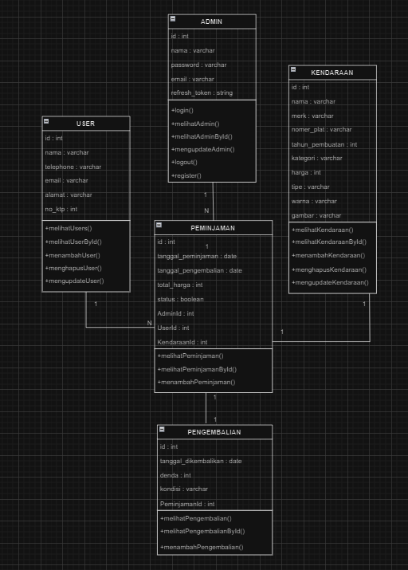
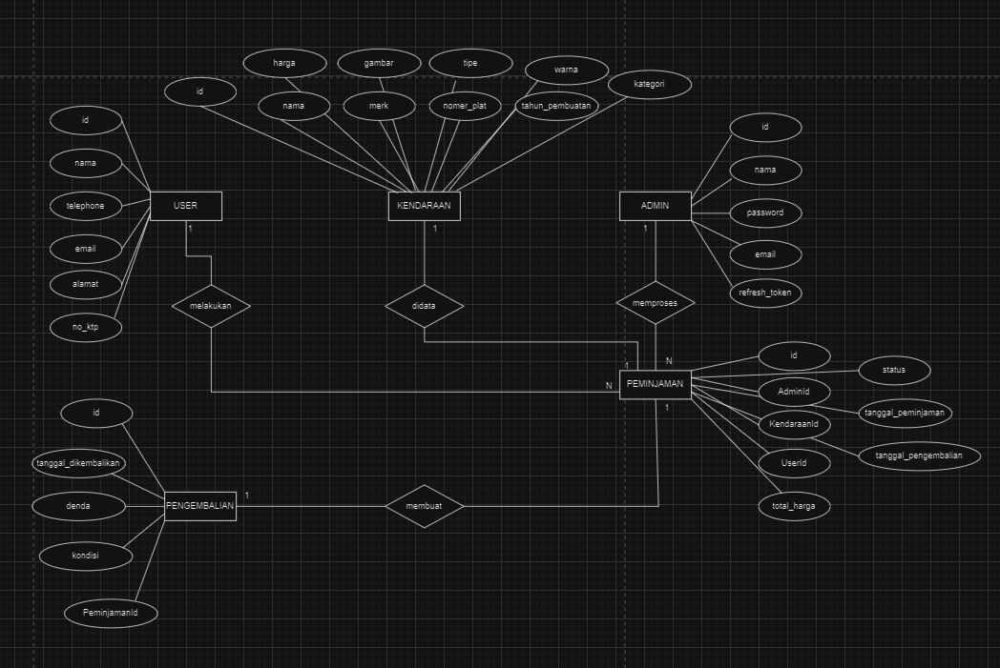
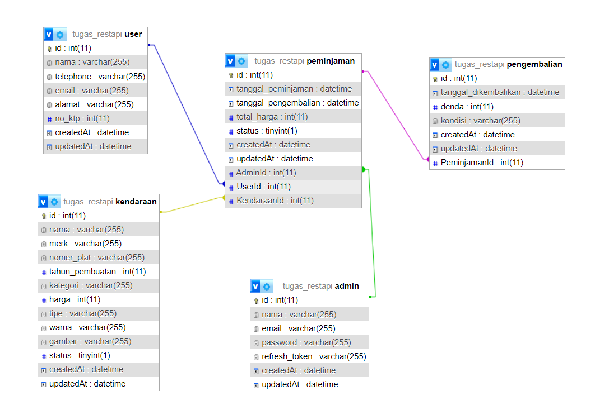

# RESTFULL API KELOLA PEMINJAMAN KENDARAAN
<br>

## Berjalan http://localhost:3100/kendaraan/

## Deskripsi Projek 

**API Kelola Peminjaman Kendaraan** adalah sebuah Rest Full API yang dirancang untuk memudahkan pengelolaan data perpustakaan menggunakan Express JS sebagai framework dan sequelize dalam pemilihan orm di Node.js. API ini memungkinkan pengguna untuk melakukan operasi CRUD (Create, Read, Update, Delete) pada user, admin, kendaraan,peminjaman dan pengembalian.


## Fitur

- **CRUD Kendaraan**: 
  - **Create**: Tambahkan kendaraan baru ke dalam data.
  - **Read**: Ambil informasi tentang kendaraan tertentu atau seluruh koleksi kendaraan.
  - **Update**: Perbarui detail kendaraan yang sudah ada.
  - **Delete**: Hapus kendaraan dari dalam data.

- **CRUD User**: 
  - **Create**: Daftarkan User baru dengan informasi lengkap.
  - **Read**: Ambil detail User atau daftar semua User.
  - **Update**: Perbarui informasi USer yang sudah terdaftar.
  - **Delete**: Hapus USer dari sistem.

- **CRUD Admin**: 
  - **Register**: Daftarkan Admin baru dengan informasi lengkap.
  - **login**: Admin melakukan login dengan email dan password.
  - **logout**: Admin melakukan logout.
  - **Read**: Ambil detail Admin atau daftar semua Admin.
  - **Update**: Perbarui informasi Admin yang sudah terdaftar.
  - **Delete**: Hapus Admin dari sistem.

- **CRUD Peminjaman**: 
  - **Create**: Daftarkan Peminjaman baru dengan informasi lengkap.
  - **Read**: Ambil detail Peminjaman atau daftar semua Peminjaman.
  - **Update**: Perbarui informasi Peminjaman yang sudah terdaftar.

- **CRUD Pengembalian**: 
  - **Create**: Daftarkan Pengembalian baru dengan informasi lengkap.
  - **Read**: Ambil detail Pengembalian atau daftar semua Pengembalian.
  - **Update**: Perbarui informasi Pengembalian yang sudah terdaftar.

<br>

## Dependecies / Teknologi yang digunakan

1. **express**

    Express JS sebagai framework Node.js untuk mengelola request dan response HTTP

    ```bash
   npm i express
    ```

2. **mysql**

    package untuk melakukan koneksi ke database

    ```bash
    npm i mysql
    ```

3. **dotenv**

    Dotenv untuk mengatur variabel lingkungan
    ```bash
    npm i dotenv
    ```

4. **cors**

    Untuk memberikan akses pada forntEnd

    ```bash
    npm i cors
    ```
5. **sequelize**

    Sebagai Orm yang dipakai

    ```bash
    npm i sequelize
    ```
6. **bcrypt**

    Untuk melakukan hash dan compare

    ```bash
    npm i bcrypt
    ```
7. **jsonwebtoken**

    untuk melakukan pembuatan dan fungsi dengan token

    ```bash
    npm i jsonwebtoken
    ```
8. **cookie-parser**

    untuk melakukan parser terhadap data cookie

    ```bash
    npm i cookie-parser
    ```
9. **nodemon**

    jalankan dengan mengetikan perintah (nodemon namaFile)

    ```bash
    npm install nodemon
    ```

    Perintah ini akan menjalankan server secara terus menerus

    Aplikasi akan berjalan pada port yang ditentukan di file `.env` .

    <br>
    

## Cara Penggunaan

1. Pastikan Node.js dan npm telah terinstall di komputer Anda.
2. Clone atau download projek ini ke direktori lokal Anda.
3. Jalankan `npm install` untuk menginstall dependensi yang diperlukan.
4. Buat file `env` dan beri variabel PORT dan DB_NAME (sesuai nama database).
5. Jalankan `node models/index.js` untuk membuat Table.
6. Untuk melakukan testing / mengisi contoh data jalankan `node seeders/seeders.js` (opsional).
6. Jika table database sudah dibuat jalankan aplikasi dengan command `node index.js` / `nodemon index.js`.
7. Aplikasi akan berjalan di `http://localhost:PORT`, dengan PORT adalah nomor port yang ditentukan dalam file `.env`.

<br>

## NOTES

1. register pada admin memerlukan `confirmasi password`.
2. path `/admin/` dan `/admin/find/{id}`  memerlukan token untuk akses.


<br>

## Router
### **user/admin/kendaraan/peminjaman/pengembalian**
- get (  /user/ ) 
- getById (/user/find/1)
- post (/user/create)
- put (/user/update)
- delete (/user/delete)


## Hal Yang Berkaitan

Beberapa Contoh Gambar Yang Berkaitan Terkait Projek REST FULL API Manajemen Peminjaman Kendaraan

- **Class Diagram**


- **ERD (Entity Relationship Diagram)**



- **Relasi Table**


<br>


## Kontribusi

Jika Anda ingin berkontribusi pada projek ini, silakan lakukan pull request dengan perubahan yang Anda inginkan. Pastikan perubahan Anda sesuai dengan tujuan dan struktur projek ini.

```
    Buat Code Disini
```

<br>

## Kontak

- **Nama:** Syahreza Imam Wahyudi
- **Email:** [syahrezaimamwahyudi976@gmail.com](mailto:syahrezaimamwahyudi976@gmail.com)
- **Website:** [www.https://github.com/Syahrezaimamw.com](https://github.com/Syahrezaimamw)

<br>


 


